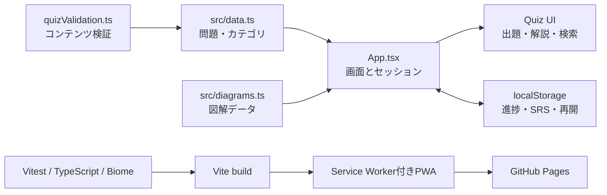
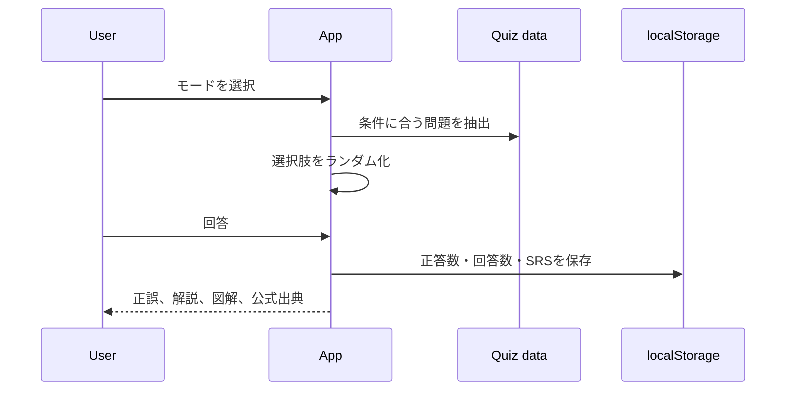
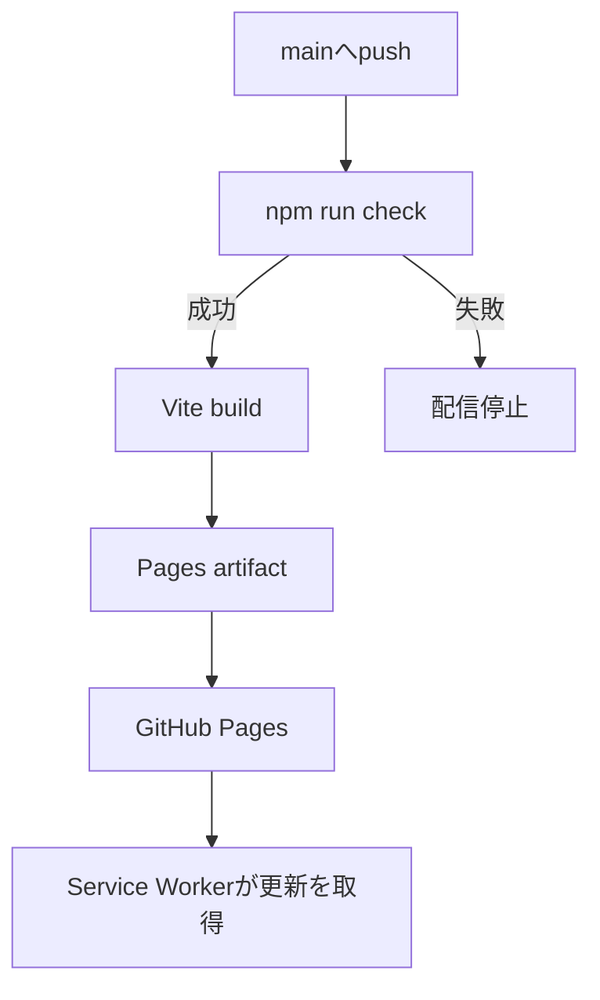

# アーキテクチャ

Codex Quizは、React + TypeScript + Viteで構成したブラウザ完結型PWAです。サーバーやログインを必要とせず、問題データと学習履歴を端末内で扱います。

## 全体像

## 主なモジュール

| ファイル | 責務 |
|---|---|
| `src/data.ts` | 型、カテゴリ、学習目標、問題データ |
| `src/App.tsx` | 画面遷移、クイズ進行、検索、入出力、URL共有 |
| `src/domain/choiceOrder.ts` | 選択肢と正解位置のランダム化 |
| `src/domain/progressData.ts` | 保存データの解釈と検証 |
| `src/domain/spacedRepetition.ts` | 正誤に基づく次回復習日の計算 |
| `src/diagrams.ts` | 問題IDに対応する図解定義 |
| `src/components/DiagramRenderer.tsx` | terminal / flow / comparison / configの表示 |
| `src/quizValidation.ts` | 問題データの機械検査 |
| `src/scenarios.ts` | 将来のシナリオ学習用データ。現時点ではUI未接続 |

現状は機能の多くを `App.tsx` が統括しています。機能境界は存在しますが、画面単位の分割は今後の課題です。ロードマップ上の理想構造を現状として説明しない方針です。

## クイズのデータフロー

正解位置の暗記を防ぐため、問題データの `answer` は表示前に選択肢と一緒に並べ替えます。保存時は問題IDを安定キーとして使います。

## 保存とプライバシー

学習履歴、ブックマーク、SRS、途中セッションはブラウザの `localStorage` に保存します。外部分析サービスやバックエンドへ送信しません。JSONエクスポートは端末移行用で、インポート時に構造を検証します。

この方式は簡単でオフラインに強い一方、ブラウザデータ削除で履歴が失われ、複数端末で自動同期されません。

## PWAと配信

Viteの本番成果物 `dist/` にmanifestとService Workerを含めます。`main`へのpushで品質ゲートを通過した成果物をGitHub Pagesへ配信します。

初回だけリポジトリ設定でPagesのSourceをGitHub Actionsにする必要があります。詳細は[プロジェクトREADME](../README.md#github-pagesへのデプロイ)を参照してください。

## 信頼境界

- 問題の事実根拠はOpenAI公式Codexドキュメントを優先します。
- 外部URLは表示用の出典であり、アプリ実行中に内容を取得しません。
- インポートデータは信用せず、期待するキーと値を検証します。
- PWAは静的配信であり、秘密情報をリポジトリやビルド成果物へ含めません。
