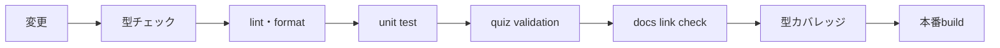

# 品質運用

品質は、コードが動くこと、問題が学習に役立つこと、公式仕様に追従することの3層で管理します。

## push前ゲート

`npm run check` が全検査を順番に実行します。途中で失敗した変更はPagesへ配信しません。

| 検査 | 防ぐ問題 |
|---|---|
| TypeScript | 型の不整合、未定義値の扱い |
| Biome | 危険なコードパターン、表記揺れ |
| Vitest | SRS、保存、選択肢並べ替え、問題検証の回帰 |
| quiz validation | 重複、壊れた正解、出典不足、メタデータ不足 |
| docs link check | 文書の移動・改名による案内切れ |
| type-coverage | 暗黙の型抜け |
| Vite build | 配信成果物を作れない変更 |

GitHub ActionsではPull Requestと `main` push時に同じゲートを実行します。Pages workflowもデプロイ前に再実行します。

## コンテンツ監査

### 問題追加時

1. 現在のOpenAI公式ページを読む。
2. 正解だけでなく、各誤答がなぜ違うか確認する。
3. `referenceUrl` と `verifiedAt` を記録する。
4. `topic` が既存問題と重複する場合、別の学習判断か確認する。
5. [コンテンツ品質基準](CONTENT_QUALITY.md)と[クイズ管理](QUIZ_MANAGEMENT.md)に照らす。

### 定期的なdrift監査

少なくとも月1回、またはCodexの大きな更新後に次を行います。

1. CLI、設定、権限、surface、成熟度など変化しやすいtopicを抽出する。
2. `verifiedAt` が古い問題から公式ページを再確認する。
3. 正解、誤答、解説、図解をまとめて更新する。
4. 廃止機能は黙って置換せず、問題の学習目標が同じか判断する。
5. `CONTENT_COVERAGE.md` と問題数表記を同期する。

現時点ではVerified Factsの独立データと自動リンク到達確認は未実装です。人手監査を支援する仕組みとして、topic・URL・確認日を先に整備しています。

## リリース確認

- `npm run check` が成功する。
- READMEの機能一覧と実装が一致する。
- PWAを狭い画面と広い画面で操作できる。
- 新規問題の正解位置が表示時に変わっても正しく採点される。
- 解説と図解が回答後・リーダー・読んでから解くモードで表示される。
- PagesのActions runが成功し、公開URLで新しい版を確認できる。

## 現在の重点課題

- 既存60問への価値・難易度・topic・公式URL・確認日の付与。
- 不正解別feedbackを持つ選択肢スキーマへの移行。
- 正解だけが目立つ選択肢を検出するコンテンツlint。
- 公式ドキュメント更新とtopicを結ぶVerified Facts。
- 主要ユーザーフローのブラウザE2Eとアクセシビリティ検査。
