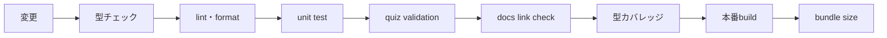

# 品質運用

## Bundle size

`npm run check`は本番build後にentry JavaScriptを検査し、raw 440 KiBまたはgzip 135 KiBを超えた場合に失敗する。問題追加で上限へ近づいた場合は、データ分割・lazy load・vendor chunk分離を検討し、理由なく上限だけを引き上げない。

品質は、コードが動くこと、問題が学習に役立つこと、公式仕様に追従することの3層で管理します。

## push前ゲート

```mermaid
flowchart LR
  C[変更] --> T[型チェック]
  T --> L[lint・format]
  L --> U[unit test]
  U --> Q[quiz validation]
  Q --> D[docs link check]
  D --> V[型カバレッジ]
  V --> B[本番build]
  B --> S[bundle size]
```

`npm run check` が全検査を順番に実行します。途中で失敗した変更はPagesへ配信しません。

| 検査 | 防ぐ問題 |
|---|---|
| TypeScript | 型の不整合、未定義値の扱い |
| Biome | 危険なコードパターン、表記揺れ |
| Vitest | SRS、保存、選択肢並べ替え、問題検証の回帰 |
| quiz validation | 重複、壊れた正解、出典不足、メタデータ不足 |
| diagram validation | 図の空欄、手順不足、途中で切れた説明文 |
| docs link check | 文書の移動・改名による案内切れ |
| type-coverage | 暗黙の型抜け |
| Vite build | 配信成果物を作れない変更 |
| bundle size | 初期JavaScriptの意図しない肥大化 |

GitHub ActionsではPull Requestを共通のQuality Gate workflowで検査します。`main` pushと手動公開時はPages workflowが同じQuality Gateを呼び、通常検査・ブラウザE2EとPWA・Lighthouseの全jobが成功した時だけ本番ビルドとデプロイを開始します。どれかが失敗またはskipされた場合は後続jobも進みません。

## コンテンツ監査

### 問題追加時

1. 現在のOpenAI公式ページを読む。
2. 正解だけでなく、各誤答がなぜ違うか確認する。
3. `referenceUrl` と `verifiedAt` を記録する。
4. `topic` が既存問題と重複する場合、別の学習判断か確認する。
5. [コンテンツ品質基準](CONTENT_QUALITY.md)と[クイズ管理](QUIZ_MANAGEMENT.md)に照らす。

### 定期的なdrift監査

少なくとも月1回、またはCodexの大きな更新後に次を行います。

1. CLI、設定、権限、surface、成熟度など変化しやすいtopicを抽出する。
2. `verifiedAt` が古い問題から公式ページを再確認する。
3. 正解、誤答、解説、図解をまとめて更新する。
4. 廃止機能は黙って置換せず、問題の学習目標が同じか判断する。
5. `CONTENT_COVERAGE.md` と問題数表記を同期する。

`npm run content:links`は、問題が参照する公式URLを重複を除いて実際に開き、404・410を検出します。ネットワーク障害などで確認できなかったURLがあれば成功扱いにせず、別の終了コードで知らせます。外部サイトの一時障害で通常の編集や公開を止めないため、`npm run check`には含めず、コンテンツ監査時に実行します。この検査はページの存在のみを確認し、節アンカー・本文・正解の妥当性は人が公式資料を読んで確かめます。Verified Factsの独立データと自動差分監査は未実装です。

## リリース確認

- `npm run check` が成功する。
- READMEの機能一覧と実装が一致する。
- PWAを狭い画面と広い画面で操作できる。
- 新規問題の正解位置が表示時に変わっても正しく採点される。
- 解説と図解が回答後・リーダー・読んでから解くモードで表示される。
- PagesのActions runが成功し、公開URLで新しい版を確認できる。
- Pages workflow内のQuality Gateにあるquality・e2e・lighthouseの3 jobがすべて成功する。

## 現在の重点課題

- 全264問のうち未再監査の問題を、古い確認日と実務上の影響から優先して現行公式資料へ照合する。
- 正解・誤答別feedback・図解を同時に点検し、名称暗記や自明な誤答を実務判断へ改善する。
- 公式ドキュメント更新とtopicを結ぶVerified Factsの仕組みを検討する。
- 既存のブラウザE2E・axe検査と手動のキーボード・読み上げ確認を継続する。
